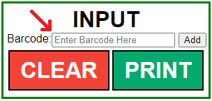
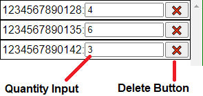
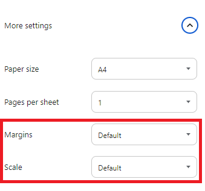

Barcoding Help  
    

Barcode Page Generator
======================

This page is designed to vastly speed up the process of labelling boxes of stock with accurate barcode counts. It creates Sheets of up to 24 barcodes with quantity labels plus a grand total which can be attached to sealed boxes to give accurate representations of the stock inside.This is useful for speeding up stock-taking stockrooms and keeping track of out-of-season items that have been boxed up.

Entering barcodes
=================

Adding barcodes to the sheet is very simple and can be done in 2 ways.

*   Scanning the barcode
*   Typing the barcode in

To scan the barcode in just select the barcode input shown in the screenshot on the right and then scan the product you wish to add. This will enter the barcode then clear the input ready for the next product to be scanned.

To enter the barcode manually simply type the number into the same box and either press enter or click the "add" button. Pressing enter will clear the input just like scanning would. Pressing "add" will instead **highlight the input rather than clearing it.** This is to make it easier to enter the same barcode multiple times when entering it manually.

Input verification
------------------

The page will automatically check if the barcode you have entered is valid (correct length, only numbers etc). If you have entered an invalid barcode, either by mis-typing a digit or by accidentally scanning the QR code present on many labels, the page will warn you of the error and will not add it to the page. Make sure to **clear the alert** before continuing scanning.

Recommended best practice
-------------------------

To keep errors to a minimum it would be best to start with an empty box and scan each individual item as you add them to the box. Then once the box full the sheet can be printed and the box sealed to make sure nothing is accidentally added or removed.

The page does also include the ability to manually edit quantities if required.

Editing quantities
==================

As you scan barcodes the page will automatically keep running totals of the barcodes you have already entered. If you want to manually change one of these quantities, simply find the barcode you want to change the quantity of in the list and enter the new desired quantity into the input box (shown in the screenshot on the right) on the same row.

The page will check and let you know if you make a mistake when entering the quantity such as including letters.

Removing barcodes
-----------------

If you wish to remove a barcode, it can be done easily by clicking the button marked with "❌" in the same row as the barcode you wish to remove. The page will confirm with you which barcode you have selected and ask if you really want to remove it before actually removing it from the sheet.

If you wish to completely clear the sheet and start over you can do so by clicking the red "CLEAR" button below the barcode input. The page will check with you to ensure you really did want to clear the page. If you click "OK" it will remove all barcodes from the sheet so that you can start from scratch.

Printing
========

Once you are finished a box, printing the page(s) is very easy. Press the green "PRINT" button in the input panel and it will automatically format the page ready for printing. It will print out 3 columns and 8 rows per page with the grand total item count showing on the last page.

The only thing to check is that your print settings are set to default for both margins and scale (set scale to "Actual Size" if using Microsoft Edge). A screenshot of the settings for chrome is on the right. These settings _should_ be set to default already but are worth checking if the page is not printing correctly.

This will ensure that page breaks behave correctly if printing multiple pages.
